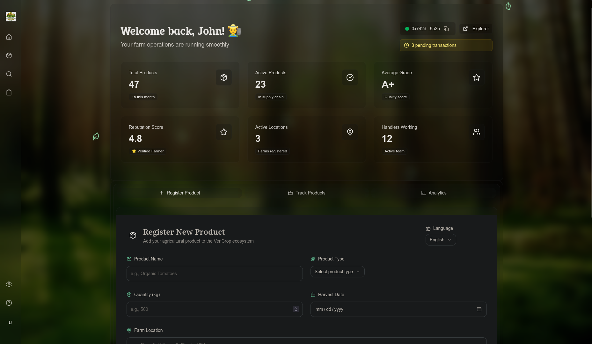
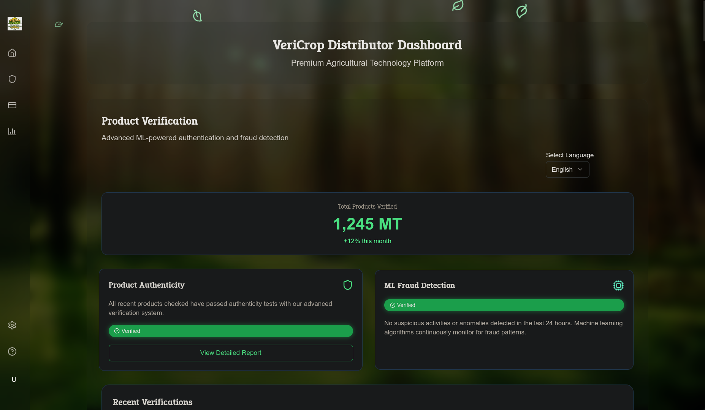
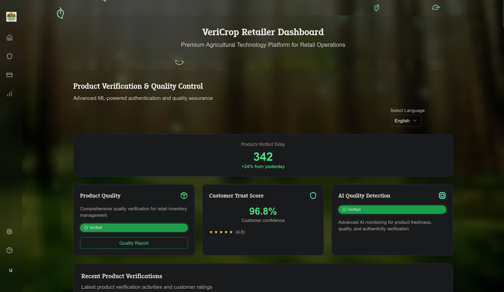
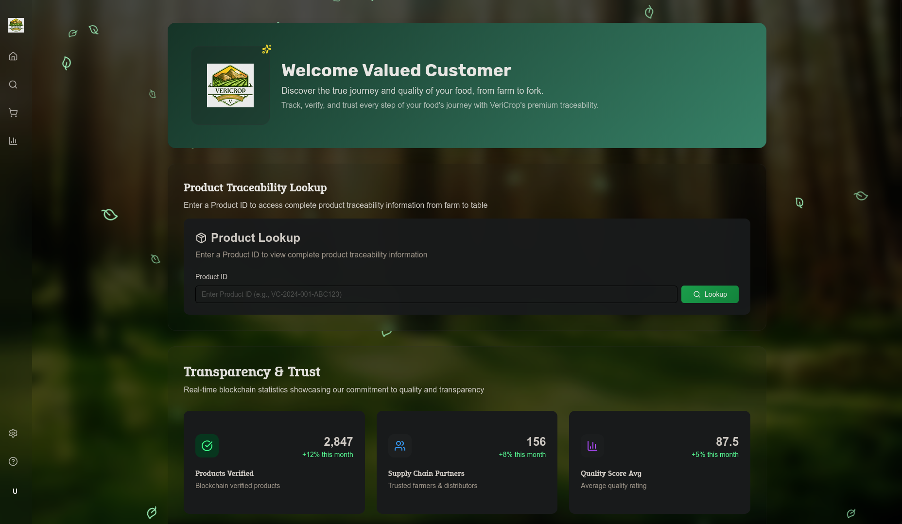

# 🌾 VeriCrop - Blockchain Traceability for Agriculture

> **Blockchain-powered transparency system for agriculture with virtual IoT, Chainlink oracles, and AI verification.**

VeriCrop is a cutting-edge platform that revolutionizes agricultural supply chains through real-time verification, secure blockchain logging, and intelligent fraud detection. We ensure authenticity and quality from farm to consumer table.

---

## 🎯 Why VeriCrop?

The global agricultural supply chain loses **$40+ billion annually** to food fraud and adulteration. VeriCrop solves this by embedding authenticity checks at every stage:

- **Farmers** → Transparent records & fair market access
- **Distributors** → Verified batch tracking & compliance
- **Retailers** → Quality assurance & consumer trust
- **Consumers** → Confidence in product authenticity & origin

---

## ✨ Key Features

### 🔗 **Blockchain-Powered Traceability**
- Immutable supply chain records from farm to consumer
- Secure, transparent transaction logging
- Regulatory compliance & audit trails

### 🤖 **AI-Driven Verification**
- ML-powered damage detection
- Real-time quality assessment
- Automated fraud detection

### 📡 **Virtual IoT Sensors**
- Blockchain-integrated condition monitoring
- Real-time environmental tracking (temperature, humidity, etc.)
- Cost-effective alternative to physical IoT hardware

### 🔮 **Chainlink Oracles**
- Decentralized data feeds for verification
- Real-world data integration
- Cryptographically secured authenticity checks

### 📊 **Smart Analytics Dashboard**
- Supply chain visibility
- Performance metrics
- Risk assessment & alerts

---

## 👥 User Roles & Dashboards

### 🌱 **Farmer**
- Register crops and batches
- Record harvest data
- Monitor crop conditions
- Receive fair market pricing



### 🚚 **Distributor**
- Track batch shipments
- Verify product quality
- Manage inventory
- Ensure cold chain compliance



### 🏪 **Retailer**
- Source verified products
- Display authenticity certificates
- Build consumer confidence
- Track sales analytics



### 🛒 **Consumer**
- Scan QR codes on products
- View full supply chain history
- Check quality & authenticity
- Make informed purchasing decisions



---

## 🏗️ Technology Stack

- **Frontend:** Next.js 14, TypeScript, TailwindCSS
- **Smart Contracts:** Chainlink Integration, Web3.js
- **AI/ML:** Quality detection, fraud analysis
- **Blockchain:** Ethereum-compatible networks
- **Database:** Decentralized & traditional backends
- **State Management:** Redux

---

## 📋 Getting Started

### Prerequisites
- Node.js 18+ and npm
- Web3 wallet (MetaMask recommended)
- Access to blockchain testnet

### Installation

```bash
cd frontend/webapp
npm install
npm run dev
```

Visit `http://localhost:3000` and connect your wallet.

---

## 🚀 Core Capabilities

| Feature | Benefit |
|---------|---------|
| **Real-time Verification** | Instant authenticity confirmation at each supply chain step |
| **Virtual IoT Monitoring** | Track conditions without expensive hardware infrastructure |
| **AI Quality Detection** | Automated damage & quality assessment with ML models |
| **Blockchain Immutability** | Tamper-proof records ensure accountability |
| **Chainlink Oracles** | Decentralized, verified data feeds for trust |
| **Consumer QR Scanning** | End-to-end transparency from farm to table |
| **Compliance Reporting** | Automated audit trails for regulatory requirements |
| **Sustainable Farming** | Support for certifications & eco-friendly practices |

---

## 💡 Use Cases

✅ **Organic Certification Verification** - Prove farms meet organic standards  
✅ **Cold Chain Compliance** - Monitor temperature throughout distribution  
✅ **Counterfeit Prevention** - Detect fake premium products  
✅ **Sustainable Sourcing** - Verify ethical farming practices  
✅ **Regulatory Compliance** - Meet food safety & traceability requirements  
✅ **Premium Market Access** - Farmers get fair prices for certified products  

---

## 🔐 Security & Trust

- **End-to-end encryption** for sensitive data
- **Chainlink-verified** external data feeds
- **Cryptographic signatures** for authenticity
- **Decentralized consensus** for accountability
- **Regular security audits** & compliance checks

---

## 📊 Impact Metrics

- **$40B+ fraud prevention** potential
- **Real-time verification** reduces supply chain delays by 30%
- **99.9% uptime** blockchain infrastructure
- **Sub-second verification** times with AI

---

## 📚 Documentation

- [API Documentation](./frontend/webapp/README.md)
- [Smart Contract Specs](./specs/)
- [Feature Specifications](./specs/)
- [Component Architecture](./frontend/webapp/components.json)

---

## 🤝 Contributing

We welcome contributions! See our [setup guide](./frontend/scripts/setup-plan.sh) for development environment setup.

---

## 📜 License

This project is licensed under the MIT License - see LICENSE file for details.

---

## 📞 Support & Contact

For questions, issues, or partnerships:
- 📧 Email: info@vericrop.io

---

**Building trust in agriculture, one blockchain at a time. 🌾✨**
